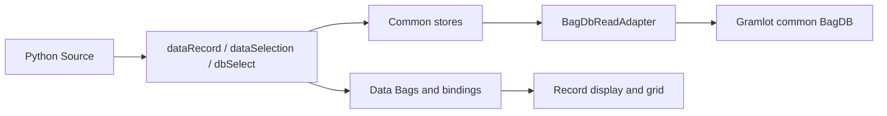

# 020 · Local database laboratory

Document ID: **GP-020**. Status: **working PoC; clean-product acceptance pending**.
[Compact view](../../docs_llm/development/020-bagdb-laboratory.md).

<a id="gp-020-005"></a>

## 005 · Ownership and experiment location

**005.1** Owner decision, 2026-09-17: DB integration experiments run in gramlot-poc.
BagDB belongs to Gramlot's common JS library, not genro-bag-js. The generic utility
moved to `js/dom/src/database/common/bagdb.js`, its tests to `js/dom/tests/bagdb.test.js`,
and its [library guide](021-bagdb-library.md) here. The candidate Bag JS worktree no
longer contains the implementation, test, guide or export. Gramlot still depends on
Bag JS for the Bag itself. No package publication or clean-core acceptance occurred.

**005.2** Provenance: genro-bag-js candidate over base
`faf6bef3badb389d25ea4cb3b35c5369cb7ffd8a`; original source SHA-256
`0b7fd4130cca6e7db9031ef3412c26e2c5992f5899ab3f4083664c09ffdc3c88`.
The transferred implementation changes only its Bag import. Source, test and guide
were uncommitted; the base commit alone does not reproduce them. New Gramlot code
uses the ordinary pinned Bag dependency, not BAGDB_SOURCE or an external candidate.
Preparation/review remains tracked under PORT-0001-bagdb-read-stores.

**005.3** New PoC guides use namespace **GP**, distinct from core GC and hosts GD/GF.
GP-020 and GP-021 share IDs/anchors with their compact mirrors. Earlier PoC guides
still have incomplete ID/mirror coverage; this does not silently renumber them.

<a id="gp-020-010"></a>

## 010 · Layers and declarations

**010.1** BagDB handles fixture schema, PK/FK integrity, reads, setup CRUD and optional
explicit save-on-close. `BagDbReadAdapter` implements readonly neutral operations;
common Collection/Selector/RecordStore and ModelCatalog retain the GC-020 experimental
separation. These framework APIs are not a settled public product contract.



**010.2** `root.bagDb(adapter='local', source='=fixture', tables=...)` installs a
Source-owned DB from a copied fixture Bag. The explicit table registry maps logical
names to fixture table names, with optional selector key/caption/search fields.
The fixture is sampled during installation, not live-synchronized back to the DB.
There is no implicit adapter or automatic table exposure.

**010.3** `dataRecord(destination, adapter=..., dbtable=..., pkey=..., fields=None,
statuspath=None, _on_start=True)` loads a single row into a Bag; null selection or
missing identity writes null. Status distinguishes `found: false` from errors.
Keys remain typed. No creation sentinel, locking, eager relations or saving.

**010.4** `dataSelection(destination, adapter=..., dbtable=..., fields=None,
where=None, orderBy=None, limit=50, statuspath=None, _on_start=True)` publishes a Bag
of row attributes, directly consumable by `grid(store='^rows', datamode='attr',
identifier='id')`. Filters are typed equality AND; ordering precedes limit (1–1000),
with identity tie-break. Status includes hasMore, not an implicit continuation.
Use a whole-value Data binding for filters; nested binding strings are not expanded.

**010.5** `dbSelect(dbadapter='local', dbtable=..., value='^key', ...)` uses the same
read adapter and SelectorStore, without the RPC requirement. Existing remote dbSelect
remains supported. Search tries prefix then containment only on zero prefix hits;
case-insensitive means JS lowercase here. It does not promise SQLite Unicode-casefold
parity (e.g. Straße/STRASSE). Off-page identity resolution reads directly.

<a id="gp-020-015"></a>

## 015 · Lifecycle and explicit boundaries

**015.1** Each controller owns its store and private state Data Bag; successful
results are published into declared application Data destinations inside `live()`.
Errors preserve previous destination data and publish error/stale status when a
statuspath is declared. New requests supersede earlier ones; removal/disposal
cancels stores and prevents late publication. Removing the adapter releases its
consumers. Independent queries do not share mutable store state.

**015.2** Existing dbSelect still represents identities as strings and treats empty
string as no selection. The local bridge converts canonical integer lookup strings
back to L keys; it does not change the widget's bound-value contract. A numeric
value chosen in that old widget must not be assumed to remain numeric for dataRecord.
The lab therefore uses T keys such as '001'; typed numeric record reads are tested
separately. Typed widget identities remain follow-up work, not a silent coercion in
the neutral adapter. Existing widget busy-request behavior also remains unchanged.

**015.3** Metadata provides scalar dtype/nullability and forward/inverse model edges.
Field/fieldcell construction and recursive relationTree UI are not implemented here.
No new dbComboBox, server provider, authorization layer, RPC contract, save controller,
record hierarchy, decimal/date/composite keys or advanced GenroPy capability is claimed.
The BagDB TYTX reserved-suffix input gap remains documented in its own guide.

<a id="gp-020-020"></a>

## 020 · Running and evidence

**020.1** [Python laboratory](../examples/bagdb/pages/index.py) exercises selector,
record, ordered collection, reactive limits, missing/clear states, Show source and
shared Inspector. Export it after preparing browser resources:

```sh
.venv/bin/python scripts/prepare_assets.py
.venv/bin/python scripts/build_browser_distribution.py
.venv/bin/python docs/examples/bagdb/export.py /tmp/gramlot-bagdb-demo
python3 -m http.server 8079 --bind 127.0.0.1 --directory /tmp/gramlot-bagdb-demo
```

The exporter refuses to overwrite an existing output directory. Host code only
mounts Python-generated Source; application events and state use Gramlot.

**020.2** Automated evidence: 10 transferred BagDB tests, 12 read-adapter/store tests,
3 Source/runtime tests, and Python declaration/serialization checks. Related local
logic, collection-store and selector suites were also run. SQLite/FastAPI's existing
round-trip test required updating fixture injection to `GramlotApplication(...,
db_handler=...)`; no server adapter code changed. Detailed final counts are recorded
in the port record, separately from visual observations.

**020.3** Browser observation: initial Alice record and two sorted rows; missing
identity yields found=false; restore works; containment 'lic' yields ALICE/Alice/Malice;
choosing Malice loads Roma; limit 4 loads all rows and hasMore=false. Source opens
Python code; Inspector opens live Data. This verifies the local path only. Remaining
DB work is tracked explicitly instead of treating the entire legacy surface as done.

Scenario update — 2026-09-17: the lab grid now displays invoices filtered by the
selected customer, rather than a second customer list. The collection-limit control
is removed; the invoice query has limit 50. Selection drives dataRecord and a reactive
invoice filter/dataSelection. The earlier limit-control observations above remain
historical evidence of the previous scenario. Fixture dates are T and amounts R.

Model update: [GP-025](025-abstract-database-model.md) implements the abstract metadata
provider/catalog and bounded model relation tree. Earlier references to the recursive
tree being absent are superseded for this bounded eager slice; lazy loading remains open.


### Complete file-backed fixture — 2026-09-17

The current laboratory supersedes the small Alice fixture with all 18 legacy
CSV tables (17,538 rows), stored in `mydb/struct` and `mydb/data`. Earlier browser
observations above describe the previous fixture. See the [current dataset,
reproduction and capability limits](../examples/bagdb/README.md).
