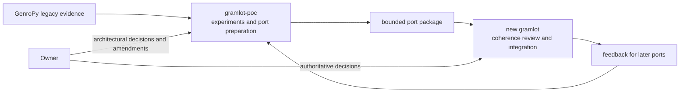

# Gramlot repository transition

Date: 2026-09-16. [Consolidation guide](00-consolidating-gramlot.md).
[Concise version](../docs_llm/00-01-repository-transition.md).

## 1. Decision and scope

The current repository becomes **`gramlot-poc`**, a living laboratory. It keeps
its complete Git history, branches, tags, pages, examples, tests, inventory,
experimental code and future exploratory work. Renaming the repository does not
rename its Python distribution or imports: the PoC continues to build and import
`gramlot` so its existing applications remain usable.

A new, history-independent **`gramlot`** repository becomes the authoritative
product. It starts with the agreed constitution and product documentation, then
receives small reviewed ports. It does not begin as a copy of the PoC and does not
contain a nested `versione2/` directory.

The plan below is preserved as the execution reference. The completion record
in section 12 describes the operations performed on 2026-09-16.

## 2. Non-negotiable preservation rules

### 2.1. Preserve the laboratory

The move must preserve every tracked, untracked and ignored file in the current
checkout. In particular, ignored assets, generated browser bundles, local databases,
virtual environments and runnable examples must not be lost merely because Git does
not list them. The move must also preserve the two registered linked worktrees and
their independent working changes.

No blanket commit, stash, reset, clean or history rewrite is part of the transition.
Existing changes belong to their current work. Coherent changes may be committed by
their owners before the move, but the repository rename must not force unrelated
work into one checkpoint commit.

### 2.2. Preserve identities and compatibility paths

The existing GitHub repository identity, issues, releases, tags and history follow
the PoC when `gramlot-org/gramlot` is renamed to `gramlot-org/gramlot-poc`. The new
`gramlot-org/gramlot` is a distinct repository with a new identity and clean history.

The current Codex project and conversations follow `gramlot-poc`; update their root
without deleting or recreating their project identity. Create a separate project and
LLM context for the new `gramlot`. Existing compatibility symlinks must continue to
resolve to the PoC because old conversations, editable installs and launchers refer
to the experimental repository they were created against.

### 2.3. Isolate installations

Both repositories may provide a Python distribution and import package named
`gramlot`. Do not install both into one environment. PoC verification and clean-core
verification use separate virtual environments, caches and built artifacts. A server
adapter selects one framework source explicitly for each test lane.

## 3. Verified starting point

The following facts were observed before any transition operation:

1. **3.1** The canonical checkout is
   `/Users/gporcari/Sviluppo/gramlot/gramlot`, on `develop` at `e2127a1`, with
   `origin` set to `git@github.com:gramlot-org/gramlot.git`.
2. **3.2** Its working tree is intentionally extensive: 620 tracked paths differ
   from `HEAD` (3,189 added and 42,731 deleted lines, including the Django extraction)
   and 39 entries are untracked. These counts are a diagnostic snapshot, not a
   completeness claim about ignored files.
3. **3.3** Both linked worktrees are dirty:
   `worktrees/gramlot-datarpc-poc` on `codex/datarpc-poc` and the app-managed
   chartBox worktree on `codex/chartbox-poc`.
4. **3.4** The Data RPC worktree's `.git` file points directly into the current
   physical checkout. The chartBox worktree reaches the same Git directory through
   the historical compatibility symlink. These pointers must be repaired before a
   new repository occupies the old physical path.
5. **3.5** Both `/Users/gporcari/Documents/ChatGPT/gramlot` and the historical
   `meta-genro-modules/sub-projects/gramlot` path are symlinks to the current checkout.
6. **3.6** The workspace demo launcher uses `ROOT / 'gramlot'`. Its saved process
   state and several virtual-environment records also contain old absolute paths.
7. **3.7** `gramlot-fastapi` and `gramlot-django` resolve their development framework
   from `../gramlot`; their lock files preserve that editable source. FastAPI CI also
   checks out `gramlot-org/gramlot` on `develop`. These references would silently
   select the clean repository after its creation unless they are classified first.
8. **3.8** The three server-adapter repositories already exist as separate siblings.
   Their repository names do not change in this transition.

Immediate directory or remote renaming is therefore disruptive unless the steps in
sections 4–7 are performed as one checked sequence.

## 4. Preflight and recovery checkpoint

### 4.1. Freeze path-dependent activity

Stop the presentation hosts and any test watcher, development server, editor task or
shell command whose current directory is inside the checkout or a linked worktree.
Record the stopped processes so only those processes are restarted. Do not kill
unrelated services using the same runtime tools.

### 4.2. Record all three working states

For the main checkout and both linked worktrees, record:

- resolved physical path, branch, `HEAD`, upstream and remotes;
- porcelain status, staged and unstaged binary diffs, and untracked-file inventory;
- ignored-file inventory for assets, databases, environments and other local tools;
- `git worktree list --porcelain` and every linked worktree `.git` pointer;
- checksums or a verified file manifest for recovery material.

Create a fresh, dated recovery snapshot outside the repository, following the
existing `.migration/` convention. It must cover files changed since the 2026-09-15
snapshot and the linked worktrees' dirty state. Verify the snapshot before moving
anything. A stash is not an adequate snapshot because it omits or complicates
untracked and ignored material.

### 4.3. Check external prerequisites

Before the coordinated change, verify that:

- `gramlot-org/gramlot-poc` is available and the authenticated operator can rename
  and create repositories in `gramlot-org`;
- the intended visibility and default branch of both repositories are recorded;
- branch protection, Actions secrets, Pages, webhooks and deploy keys attached to
  the existing repository have been inventoried;
- no release, package publication or deployment is running;
- there is enough space for the recovery snapshot and both local repositories.

Repository rename and creation are external GitHub mutations. Moving the checkout,
rewriting compatibility symlinks and editing sibling repositories require filesystem
access outside the current checkout. Execution tools must obtain their corresponding
network and filesystem permissions. The architectural operation has already been
approved; these are execution boundaries, not new design decisions.

## 5. Safe local split

Perform the local move before creating a new checkout at the old physical path:

1. **5.1** Move the complete directory atomically from
   `/Users/gporcari/Sviluppo/gramlot/gramlot` to
   `/Users/gporcari/Sviluppo/gramlot/gramlot-poc`. Do not reconstruct it from a clone,
   because a clone would omit the dirty and ignored state.
2. **5.2** Retarget both compatibility symlinks from the old physical directory to
   `gramlot-poc`. Keep their existing symlink names so old tasks still reach the PoC.
3. **5.3** From `gramlot-poc`, repair the registered worktrees. Confirm that every
   linked worktree `.git` pointer resolves into `gramlot-poc/.git`, never into the now
   vacant `/Sviluppo/gramlot/gramlot` path.
4. **5.4** Compare all three `HEAD`, branch and status records with the preflight
   records. Differences caused by the move are a stop condition.
5. **5.5** Change the parent demo launcher and its maintained documentation to use
   `gramlot-poc`. Discard only stale process-state records after their processes have
   been confirmed stopped; keep logs as evidence.
6. **5.6** Update the existing Codex project root to the PoC's physical path while
   retaining its project and conversation identities.
7. **5.7** Run a bounded PoC smoke check from the renamed directory: Git access in all
   worktrees, representative Python and JavaScript tests, asset preparation and the
   existing example host. Rebuild an environment only if an embedded absolute path
   prevents it from working through the preserved compatibility symlink.

Do not create `/Users/gporcari/Sviluppo/gramlot/gramlot` until step 5.4 proves that no
worktree administrative pointer can mistake that future directory for its Git owner.

## 6. Classify and rewire consumers

Every reference to `../gramlot`, `gramlot-org/gramlot` or the old physical path must
be assigned to one of two classes before the new repository appears.

| Consumer | During bootstrap | Final direction |
| --- | --- | --- |
| PoC demos, pages and historical verification | Explicit `gramlot-poc` path/repository | Stay on PoC |
| Existing FastAPI adapter compatibility tests | Explicit PoC checkout/path | Retain as a named legacy/PoC lane while needed |
| Existing Django adapter compatibility tests | Explicit PoC checkout/path | Retain as a named legacy/PoC lane while needed |
| New adapter architecture and port tests | Do not run against an empty core | Add an explicit clean-`gramlot` lane when its required contract lands |
| Genro ASGI future integration | No implicit framework dependency | Select clean `gramlot` only with an implemented contract |
| Product site and Rosetta | Preserve their current source until a reviewed port exists | Migrate through a recorded port |

Initially change the FastAPI and Django local editable sources and lock files from
`../gramlot` to `../gramlot-poc` so their current suites remain attached to the code
they were written for. Change FastAPI's current CI framework checkout to
`gramlot-org/gramlot-poc`. Later add a separately named CI lane for the clean core;
do not reuse one ambiguous path for both roles.

Historical links that document a PoC implementation should point to
`gramlot-poc`. Product-facing links should point to the new repository only after the
referenced document or API exists there. Do not rely on GitHub's rename redirect:
once a new repository takes the old name, the same URL resolves to a different object.

## 7. Safe remote split

The GitHub operations have a short ordering constraint:

1. **7.1** Rename the existing `gramlot-org/gramlot` repository to
   `gramlot-org/gramlot-poc`. Verify its repository identity, issues, releases, tags,
   branches and settings after the rename.
2. **7.2** Change the PoC checkout's `origin` to the canonical `gramlot-poc` URL and
   verify fetch and push destinations without pushing unrelated work.
3. **7.3** Land the explicit PoC references in adapter CI and other current consumers.
   Disable a consumer job temporarily if its reference cannot be corrected before the
   new repository is created.
4. **7.4** Search the workspace again for the old URL and classify every remaining
   occurrence as historical text, intended clean-core reference or defect.
5. **7.5** Only then create the new `gramlot-org/gramlot`. Verify that the old URL now
   identifies the new repository and that no PoC job switched to it accidentally.

The transition does not publish to PyPI or npm, move an existing release to the new
repository, deploy a site, or change the import name. Those are separate decisions.

## 8. Bootstrap the clean repository

Create the new local checkout at `/Users/gporcari/Sviluppo/gramlot/gramlot` only after
the worktree-pointer gate in section 5 and the consumer gate in section 6 pass.
Initialize it from clean seed content rather than old Git history.

The first accepted content is deliberately small:

- Apache 2.0 license and required notices;
- a README identifying the authoritative product and the PoC evidence repository;
- repository instructions expressing Python-first authoring, Gramlot-only examples,
  server/database independence and constitutional checking;
- the authoritative product constitution in paired human/LLM form;
- the paired `01-overview.md`, reviewed as product documentation;
- the minimal test and packaging skeleton only when its contract is agreed.

The evolution document and migration evidence remain in `gramlot-poc`. After the
product overview is admitted, replace any PoC working copy that could be mistaken for
authority with a clear pointer to the exact new-repository document or commit.

Create the new Codex project and LLM context from this clean root. Do not import the
PoC conversation as product authority; transfer only explicit decisions, selected
evidence and port packages. Apply the agreed `main`/`develop` policy when branches are
created, with `main` as the default protected consolidated line.

## 9. Port protocol between the two LLM contexts

Each transfer receives a stable port identifier. The PoC side prepares:

1. **9.1** the selected inventory card and legacy/prototype evidence;
2. **9.2** the proposed contract, responsibility boundaries and omissions;
3. **9.3** the smallest code and documentation change;
4. **9.4** meaningful contract, failure and lifecycle checks;
5. **9.5** known differences, provisional dependencies and unresolved questions.

The clean-repository side checks the package against the constitution and the current
product architecture. It records acceptance or concrete revision requests under the
same port identifier. The PoC side incorporates reusable lessons into later ports.

Neither LLM context may amend architecture merely to accept a port. A contradiction
is reported with the affected constitutional point; only the owner approves an
amendment. Technical corrections consistent with the constitution need no separate
architectural decision.

## 10. Completion gates

The repository transition is complete only when all of these statements are true:

- **10.1** `gramlot-poc` retains all three recorded working states and ignored runtime
  material; all linked worktrees resolve to its Git directory.
- **10.2** Existing PoC pages, representative tests, assets and demo host run from the
  renamed repository or its preserved compatibility paths.
- **10.3** Current adapter compatibility jobs explicitly select the PoC; any clean-core
  jobs explicitly select the new repository.
- **10.4** GitHub has two distinct verified repository identities and local `origin`
  URLs match their roles.
- **10.5** The new repository contains no inherited PoC history or accidental bulk
  source copy and owns the authoritative constitution and product overview.
- **10.6** The two LLM contexts use separate roots and record port exchanges by ID.
- **10.7** No environment accidentally combines the PoC and clean `gramlot` packages.
- **10.8** Updated workspace maps distinguish canonical PoC, canonical product,
  compatibility symlinks, worktrees and server-adapter repositories.

## 11. Readiness and remaining execution choices

The split is feasible without sacrificing the working PoC. It is not ready for an
uncoordinated rename because the current dirty state, linked-worktree pointers,
launcher paths and adapter sources are coupled to the existing name.

Before execution, record three small choices: both repositories' visibility, the
new constitution's final filename, and which existing adapter checks remain PoC
compatibility lanes at bootstrap. These choices affect repository settings and CI
labels, not the approved living-PoC/clean-product architecture.

With those values recorded, sections 4–10 provide the execution and rollback gates.
On failure before new-repository creation, restore the original directory and symlink
targets from the verified snapshot. After creation, preserve both repositories and
repair references; do not overwrite either tree with the other.

## 12. Execution record — 2026-09-16

- **12.1** Completed: living `gramlot-poc` and clean `gramlot` exist locally and on
  GitHub. PoC identity/history and all three worktrees are preserved. Both public;
  new product main/develop contain only the reviewed documentation seed.
- **12.2** Full recovery copies of eight checkouts/worktrees were hash-verified,
  including ignored files. Private checkpoint: workspace
  `.migration/20260916-repository-split/`; never commit/publish it.
- **12.3** Compatibility links and worktree pointers target PoC. Current adapter
  sources/locks/environments and FastAPI local CI explicitly use PoC. Rosetta's
  published workflow reference was updated with deployment suppressed during the
  commit; its previous enabled state was restored.
- **12.4** Existing Codex project identity follows PoC; new product has a separate
  project. Active desktop sessions may need reopening to adopt updated roots.
- **12.5** Verification: 43 PoC Python tests, 422 JS tests; FastAPI 45 passed/2 skipped;
  Django 33 passed. Adapter lint/docs passed. Git integrity passed. Three demo
  routes returned HTTP 200 on ports 8051, 8063 and 8026.
- **12.6** Demo startup now builds the required compiled browser payload. Its legacy
  environment uses the extracted local FastAPI adapter. Django uses its existing
  extracted adapter environment and preserves the original demo database.
- **12.7** Product constitution and overview are authoritative in new Gramlot;
  PoC product copies are pointers. Existing unrelated dirty work is preserved,
  not bulk-committed. No package release or application deployment performed.
- **12.8** Old static wheel-check environments remain recovery/testing evidence;
  recreate before future use rather than relying on obsolete installation provenance.
