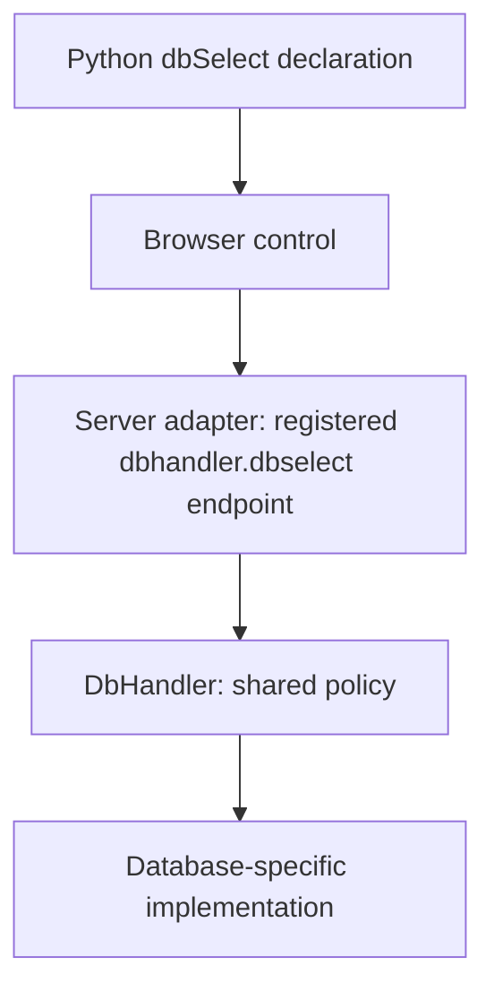

# Consolidating Gramlot

Date: 2026-09-16. [Minimal version](../docs_llm/00-consolidating-gramlot.md).

This document explains how we reach the consolidated version: working method,
document organization, decisions, evidence and outstanding work.

## 1. Document roles and reading order

`00-consolidating-gramlot.md` is the working guide. `01-overview.md` is the
[product overview](01-overview.md), part of V2 documentation intended for
distribution alongside the subsequent architecture and reference documents.
The product overview describes Gramlot itself; migration plans, prototype status
and unresolved decisions belong here or in linked working documents.

Use two-digit prefixes for ordered documents and mirror filenames in `docs_llm`.
Keep technical folder names stable; decide future documentation subfolder
numbering when needed. Owner clarification, 2026-09-16: this supersedes the
previous description of `01` as an operational consolidation guide.

Product documentation is written directly as V2 documentation. That editorial
role does not certify a release or implemented feature: admit agreed contracts,
keep speculative APIs in working documents, and verify documented behavior
against the delivered library. `versione2/` does not itself assign a package version.

## 2. Documentation conventions

Maintain matching relative filenames in `docs/` and `docs_llm/`; update both
together. The concise version preserves decisions, constraints, status and open
questions; this version adds explanations and examples. Neither may introduce
decisions absent from the other. Resolve discrepancies against owner decisions.
Use Mermaid when architectural or application diagrams help explain the text.
The `docs_llm` documents must also be human-readable: short sections, one concept
per paragraph or bullet. Use compact lists, with blank lines around headings
rather than between items. Number sections and individual summary points
hierarchically (1, 1.1, 1.2). Keep headings separated from preceding content
without repeated horizontal rules. References identify the document and point.
This refines the earlier spacing rule on 2026-09-16.

## 3. Constitutional review

The agreed principles recorded here and in subsequent agreed architecture
documents form our working constitution. Proposed layouts, illustrative examples
and open questions are not constitutional decisions.

For each new discussion or requested action, check consistency with this
constitution. If there is a contradiction, identify the relevant principle and
explain the concrete conflict before implementing the affected part. Discuss
whether to adapt the request or amend the constitution; do not silently reinterpret
either. An explicit owner decision to amend is sufficient: update both document
versions together, recording the date, the changed principle and what it supersedes.
Compatible work does not require an additional approval step.

## 4. Inventory and architecture guide the work

The existing [inventory](../../gramlot_inventory/README.md) contains both legacy
discovery evidence and initial contract cards. These have different roles:

| Material | Purpose |
| --- | --- |
| Legacy census and audits | Establish what existed and what still needs investigation |
| Selected capability cards | Specify what we decide to build or consolidate |
| Architecture documents | Explain shared boundaries, composition and decisions |
| New code and verification | Demonstrate that a selected contract is satisfied |

We progressively add or revise the cards for the work we choose. A legacy census
entry is not automatically a commitment to implement that feature. Broad legacy
coverage remains useful without making the whole census the first delivery scope.

Each selected card should identify its behavior, parameters, dependencies,
base classes or mixins, extension points, examples and known legacy differences.
It must distinguish observed legacy behavior, proposed behavior, agreed behavior
and verified implementation. Existing labels such as `da implementare` and
`da verificare` retain their meaning; verification in the old prototype does not
establish verification in version 2.

The base inventory describes shared contracts. Adapter-specific cards link to
those contracts and explain their dependencies, supported capabilities and
extensions, without duplicating the whole generic specification.

## 5. Earlier in-repository layout — superseded by section 12

**Earlier arrangement, superseded by the repository amendment below:**
`versione2/` contains the new JavaScript foundation, helpers and
progressively reviewed components, plus dedicated database adapter areas with
their documentation and code. Server adapters remain in their respective
integration folders/repositories and evolve alongside this work.

**Owner clarification, 2026-09-16:** architectural documentation proceeds in
parallel in `gramlot-fastapi`, `gramlot-genro-asgi` and `gramlot-django`.
Gramlot owns a shared document defining server-adapter responsibilities and
contracts; each integration repository owns its specific architecture and
documentation, referring back to that contract. Maintain concise `docs_llm`
counterparts alongside the human documentation there too.

The database area has four agreed divisions: `common`, `fake`, `genropy` and
`sqlalchemy`. This refines the previously generic `<adapter>` placeholder.
`common` holds shared contracts/behavior, not a concrete backend; `fake` provides
controlled implementations for contract checks; `genropy` and `sqlalchemy`
contain their specific documentation and code. SQLite is a possible database
used through SQLAlchemy, not the name of this adapter area. Detailed APIs and
the exact filesystem nesting remain to be specified.

**Proposed layout:** currently only the organization and operational overview
documents and their `docs_llm` counterparts are introduced. The layout expresses the agreed divisions; other names and
nesting remain proposals, not packages or settled distribution/import paths.

```text
gramlot/
  gramlot_inventory/             shared contracts and legacy evidence
  js/, src/, docs/               existing prototype and documentation
  versione2/
    docs/                       overview and consolidated architecture
    docs_llm/                   matching minimal documents
    js/
      core/                     minimal runtime foundations
      helpers/                  focused shared utilities
      mixins/                   reusable browser capabilities
      components/               reviewed components
    python/                     consolidated authoring and shared contracts
    adapters/
      db/
        common/                 shared database contracts and behavior
        fake/                   controlled contract-check implementation
        genropy/                GenroPy implementation and extensions
        sqlalchemy/             SQLAlchemy implementation
                                each area: docs/, docs_llm/, src/
    tests/                      checks for the admitted contracts

gramlot-fastapi/                 separate server integration workspace
gramlot-django/                  separate server integration workspace
gramlot-genro-asgi/              separate server integration workspace
```

The existing inventory stays in place for now. Existing code stays available as
reference and as a usable prototype; this document neither moves nor deletes it.
New code should expose any dependency on provisional code explicitly, so a new
folder cannot conceal continued reliance on an unreviewed implementation.
External foundational libraries need their own explicit dependency contracts;
consolidation does not imply rewriting them all inside Gramlot.


## 6. Start very small, with a sound foundation

All Gramlot work produced so far is provisional material for review: code,
experiments, documentation and proposed architectures. It is valuable evidence,
but its existence does not make it part of the consolidated library.

The new line starts with the smallest useful, carefully specified and verified
foundation. It grows by incorporating reviewed capabilities, rather than by
copying the existing library and cleaning it later. Documentation and library
code are consolidated together.

Earlier owner decisions remain inputs to this process; later corrections take
precedence. Experimental APIs, historical plans and passing prototype tests must
not be mistaken for final architectural approval.

## 7. GenroPy legacy is the behavioral reference

GenroPy legacy is the **nearly ideal behavioral model**: it contains a large body
of useful functionality and experience. Its implementation also reflects
accumulated complexity and constraints imposed by Dojo.

The purpose is to recover that functional richness through simpler, explicit
responsibilities. Preserve familiar authoring syntax and behavior where possible;
record and discuss intentional differences. Reproducing an old implementation
mechanism is not a prerequisite for reproducing its useful behavior.

For example, reviewing `textBox` means examining value binding, null and empty
values, validation, labels, events and lifecycle. It does not mean importing a
Dojo widget hierarchy. A small first slice can cover fewer features, provided
its guarantees and omissions are explicit.

## 8. Prototype examples and review evidence

### 8.1. Example: compose a reviewed input

Conceptually, a final text input combines a lifecycle base, shared label and field
state capabilities, and a text-editing implementation. Validation can remain a
shared service used through that composition; each mixin need not contain a
separate validation engine.

The card must say which layer owns Data writes, how validation reaches the UI,
and who releases subscriptions when the input is removed. Two instances must
not share accidental mutable state. Mixin requirements, method conflicts and
initialization/cleanup order need explicit treatment before a class is final.

This illustrates the composition direction, not a newly approved class hierarchy.
Python authoring mixins, browser mixins and server mixins are separate mechanisms.

### 8.2. Example: one database contract, independent hosting

The existing prototype provides this useful reference:



`DbPageMixin` registers the database proxy; the page need not reimplement a
customer lookup endpoint. The existing `SqliteDbHandler` specializes backend
access. These are prototype names and behavior to review, not code already
admitted into version 2.

A SQLite-backed selector does not belong to FastAPI simply because FastAPI
hosts its example. Changing the host should not redefine database search, and
changing the database should not redefine the visual control.

Database capabilities follow the agreed three groups: required minimum, common
optional capabilities and implementation-specific extensions. The recorded
dbSelect direction includes prefix search followed by containment and both case
modes. The prototype falls back only when prefix search returns no rows; that
detail must be stated in the consolidated contract. `auxColumns` remains a
GenroPy-specific capability under the recorded product decision.

`dataRecord` and `dataSelection` need their own selected contracts; the large
legacy parameter lists are evidence, not a ready-made minimum API. General
capability negotiation and a complete GenroPy handler are not established by
the SQLite experiment.

## 9. Consolidate one useful increment at a time

A proposed working sequence for each selected capability is:

1. Read its legacy evidence and prototype implementation; identify uncertainties.
2. Agree the bounded contract in its inventory card and the relevant architecture.
3. Identify shared foundations, mixins and adapter-specific responsibilities.
4. Implement the smallest coherent slice in the new area or the owning adapter.
5. Verify behavior, failures and lifecycle, with a Python-first Gramlot example
   when the slice is user-facing.
6. Update the card with evidence, omissions and intentional incompatibilities.

For a bound input, verification might cover initial value, user edits, external
Data changes and removal/recreation. For a database selector, it might cover
identity lookup, both search modes and backend failures independently of hosting.
The exact checks follow the selected contract rather than a universal checklist.

Server and database work proceeds alongside the core when the selected increment
needs it. This does not require implementing every host/backend combination before
the first useful result.

## 10. What remains to decide

The first runtime slice, final folder names, Python package layout, concrete
class hierarchy, mixin composition rules and adapter capability protocol remain
to be settled. Packaging and the point at which consumers adopt the new line
also need explicit decisions. No runtime migration is performed by this documentation work.

The immediate result is a shared direction: a very small consolidated Gramlot,
growing through deliberate decisions and verified additions, with the legacy
richness as its reference and the inventory as its guide.

## 11. Sources and continuity

The owner's discussion of 2026-09-16 establishes the new consolidation direction
and the `versione2` area. Earlier records supply detail, subject to that direction:

- [Recorded decisions](../../docs/context/decisions.md) and
  [open work](../../docs/context/open-work.md).
- [Components, controllers, recipes and mixins](../../docs/guides/component-controller-recipe-management.md).
- [Database handlers and proxies](../../docs/guides/database-handlers-and-proxies.md).
- [Inventory and legacy census](../../gramlot_inventory/README.md).
- [Canonical workspace map](../../docs/context/workspace-map.md).

These documents contain dated prototype states and proposals. Their historical
implementation claims do not certify the new line.

## 12. Repository amendment — 2026-09-16

The owner replaces consolidation inside one repository with two repositories:

- **gramlot-poc** is the current repository renamed, preserving its history,
  uncommitted work, pages, examples and tests. It remains a living laboratory:
  new experiments and features may originate here before porting.
- **gramlot** is a new clean repository for reviewed, consolidated code and
  product documentation. Its ordinary root layout replaces the need for a nested
  `versione2/` area. Exact technical paths are still to settle.

This supersedes the earlier in-repository destination layout, not the requirement
for incremental, verified consolidation. Until the transition is executed,
`versione2/` is staging material in the current checkout, not the final destination.
Repository renaming does not by itself rename Python/npm packages or change consumers.

The evolution document (`00`) stays with the PoC. Product documentation (`01`
and subsequent architecture documents) and the authoritative product constitution
belong to the new Gramlot. Both retain concise human-readable `docs_llm` versions.
Avoid independently maintained constitutions in both repositories: the PoC refers
to the destination authority. Historical inventory evidence remains in the PoC;
selected contract cards accompany reviewed ports into the destination.

Two separate LLM roles coordinate each port. The PoC agent examines evidence and
prepares a bounded delivery with contract, code, tests and known differences.
The destination agent checks architectural coherence and behavior, then accepts
or requests concrete revisions. Record the exchange by port identifier; use its
findings to improve subsequent deliveries. Neither agent independently amends
owner-approved architecture. Conflicts return to the owner.

Preserve the functioning PoC during transition: identify consumer paths, installed
packages, servers, remotes and compatibility links before moving them. A clean
new repository must not be obtained by discarding current work. The transition
record tracks actual operations separately from this approved destination.

Transition sequence: [repository transition](00-01-repository-transition.md).

Current state — 2026-09-16: the repositories are split. Product authority is
[the new constitution](https://github.com/gramlot-org/gramlot/blob/main/docs/00-constitution.md).
Earlier destination layouts in this guide are historical. The PoC remains active;
its uncommitted work has been preserved rather than bulk-committed.
